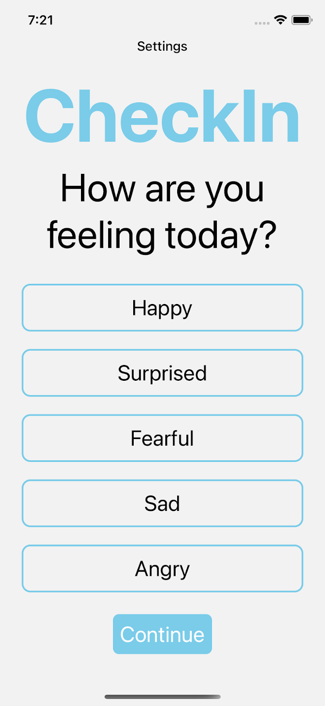
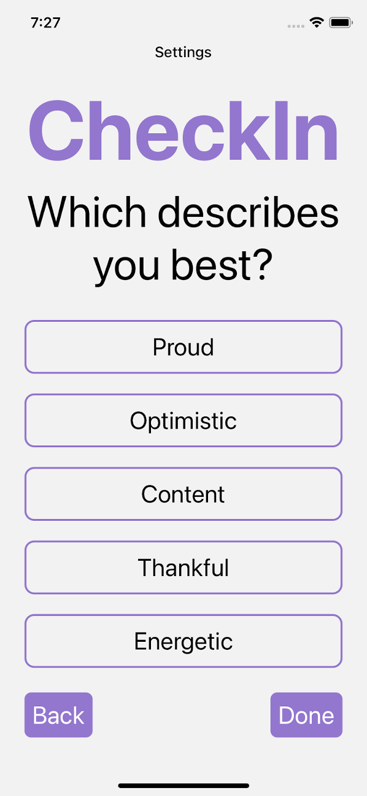
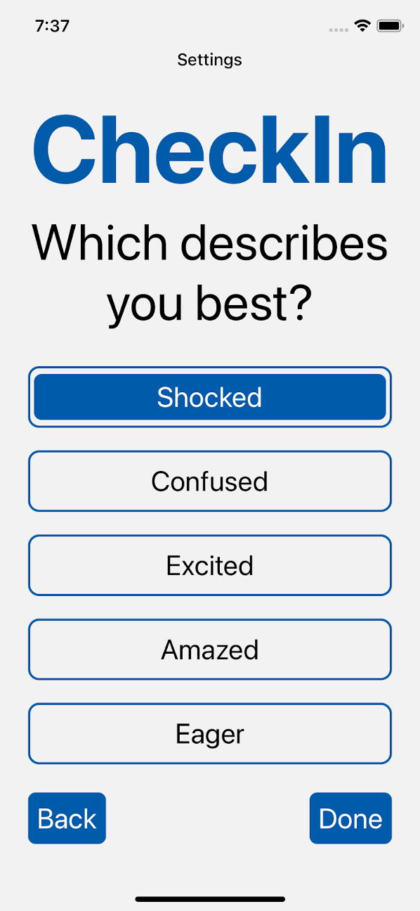
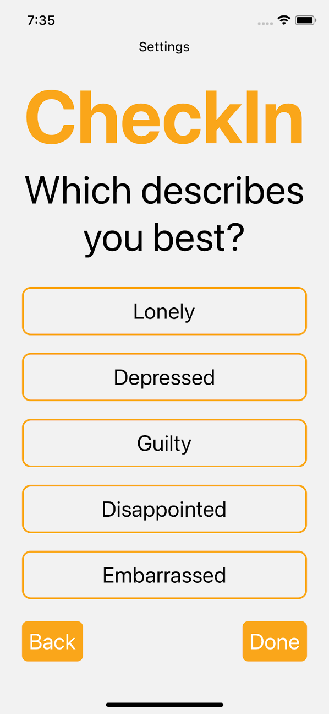
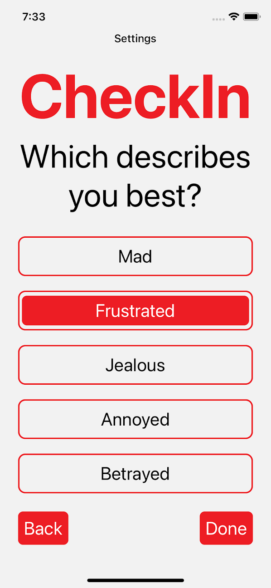
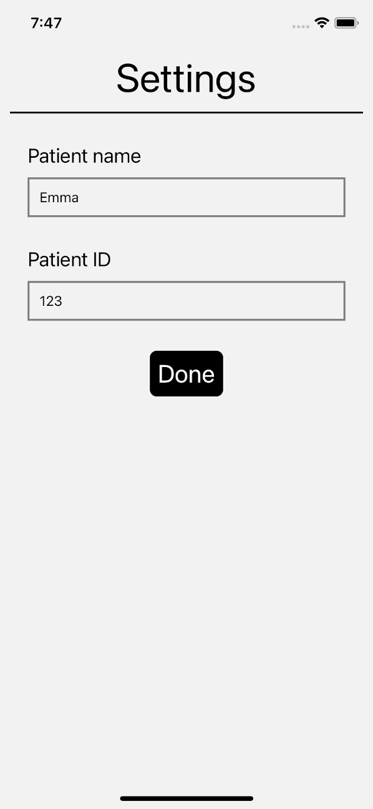
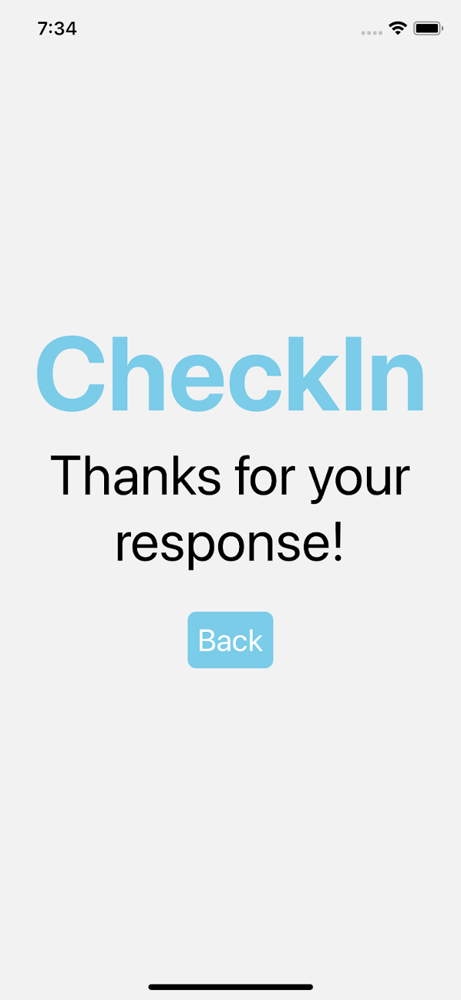

# CheckIn

A react native app that aims to improve mental health communication amongst the senior population in long-term care facilities.

Made for the programming portion of the Lassonde Games 2021 tri-hackathon competition, awarded 2nd place out of 35 teams.

## The Problem and the Idea

The primary focus of Canada’s healthcare system is on the physical health of the patient. However, mental health negatively affects a large number of people in the system, most specifically seniors residing in long-term care facilities.

Long-term care residents are people who have physical and/or mental limitations that prevent them from being able to live independently. This loss of independence and sudden isolation often takes a huge toll on residents' mental health, epecially during the COVID-19 pandemic.

Furthermore, long-term care facilities are often understaffed and their employees are overworked. When nurses are busy, their main focus is checking in on the physical health of the patient. They may not always have the time to analyze how the patient is feeling mentally.

This is where our app, CheckIn, comes into play. CheckIn aims to provide a simple UI/UX for seniors of all abilites to easily input their daily (or even hourly) feelings.

## How it Works

The app starts with the five most basic, describable feelings and allows the user to select one of them.

Then, it narrows the choices down based on the user's initial selection.

A nurse or worker can input the resident's information, such as their name and patient ID in the settings page.

Once the resident has chosen their current feeling, they are able to submit their information, which goes to an express.js server and is stored in a mongoDB database.

Ideally, a nurse or doctor would have access to the patient information via a companion web or mobile app, which would notify them of any significant trends. This would allow the nurses to best accomodate their patient's needs and allocate their time accordingly.

Given the tight time constraints of the competition, the back-end does not have any internal logic for querying or analyzing the data as of yet. The web app currently just displays the entries in order of date and time submitted.

## Ideal Improvements to Make

- Creating an actual algorithm for choosing which feelings to give as options, this can definitely be improved with some more research to increase effectiveness.
- Fully implementing a companion software for analyzing and querying entries, as well as providing analytics for tracking trends in the patients' mood over time and notifying nurses of any significant changes.
- Implementing all the necessary accessibility components that would be vital for seniors to easily use the app (larger text sizes, voiceOver, etc).
- Needs more of a focus on privacy. Currently, the only sensitive information the app sends is the patient name and/or patient ID. However, more steps would need to be taken to ensure the security of the patient data.
- Implementing a more interactive UI with the potential for video, animations and/or sound.
- A customizable notification system to remind patients to input their feelings throughout the day.
